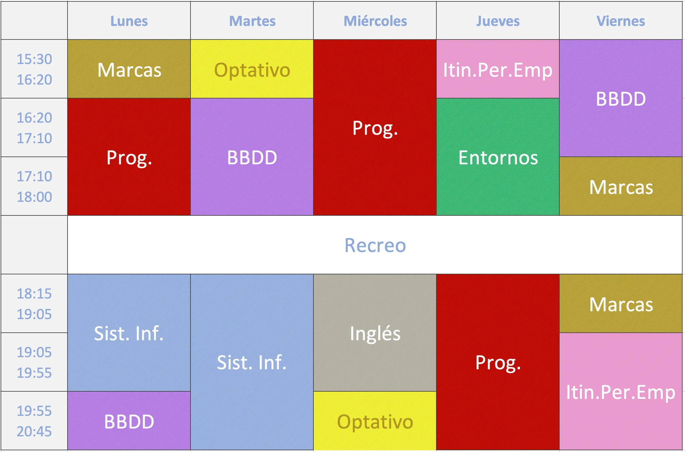

# Desarrollo de Aplicaciones Web (DAW)

Este temario y ejercicios corresponden al IES Claudio Moyano, Zamora, de la promoción 2024/2025.

Aquí podéis encontrar todo lo relativo a la tutoría del curso

\
**Primer Curso (DAW1):**

<table data-view="cards"><thead><tr><th></th><th align="center"></th><th></th><th data-hidden data-card-target data-type="content-ref"></th></tr></thead><tbody><tr><td></td><td align="center">Bases de Datos</td><td></td><td><a href="broken-reference">Broken link</a></td></tr><tr><td></td><td align="center">Programación</td><td></td><td><a href="broken-reference">Broken link</a></td></tr><tr><td></td><td align="center">Sistemas Informáticos</td><td></td><td><a href="broken-reference">Broken link</a></td></tr><tr><td></td><td align="center">Entornos de Desarrollo</td><td></td><td><a href="broken-reference">Broken link</a></td></tr><tr><td></td><td align="center">Lenguaje de Marcas</td><td></td><td><a href="broken-reference">Broken link</a></td></tr></tbody></table>

***

Horario de Clases:

<figure><figcaption>
HORARIO PROVISIONAL sujeto a modificaciones
</figcaption></figure>
