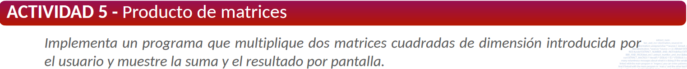

---
layout:
  title:
    visible: true
  description:
    visible: false
  tableOfContents:
    visible: true
  outline:
    visible: true
  pagination:
    visible: true
---

# Unidad 3

***


Si alguna de las soluciones de los ejercicios es incorrecta, no dudes en contactarme.


### Actividad 1 P17

<figure><figcaption></figcaption></figure>

```c
#include <stdio.h>
#include <math.h>

int main() {
    int opcion;
    float base, altura, radio, area;

        // Mostrar el menú de opciones
        printf("\nSeleccione una opción:\n");
        printf("a) Área de un rectángulo\n");
        printf("b) Área de un triángulo\n");
        printf("c) Área de un círculo\n");
        printf("d) Salir\n");
        printf("Opción: ");
        scanf("%d", &opcion);

        switch(opcion) {
            case 1:
                // Pedir base y altura para el rectángulo
                printf("Introduce la base del rectángulo: ");
                scanf("%f", &base);
                printf("Introduce la altura del rectángulo: ");
                scanf("%f", &altura);
                area = base * altura;
                printf("El área del rectángulo es: %.2f\n", area);
                break;
            case 2:
                // Pedir base y altura para el triángulo
                printf("Introduce la base del triángulo: ");
                scanf("%f", &base);
                printf("Introduce la altura del triángulo: ");
                scanf("%f", &altura);
                area = (base * altura) / 2;
                printf("El área del triángulo es: %.2f\n", area);
                break;
            case 3:
                // Pedir radio para el círculo
                printf("Introduce el radio del círculo: ");
                scanf("%f", &radio);
                area = M_PI * radio * radio;
                printf("El área del círculo es: %.2f\n", area);
                break;
            case 4:
                printf("Saliendo del programa...\n");
                break;
            default:
                printf("Opción no válida. Por favor, seleccione una opción válida.\n");
  

    return 0;
}

```

### Actividad 2 P18

<figure><figcaption></figcaption></figure>

```c
#include <stdio.h>
#include <math.h>

int main() {
    double x, resultado;

    // Pedir al usuario que introduzca el valor de x
    printf("Introduce el valor de x: ");
    scanf("%lf", &x);

    // Calcular el valor de f(x) según la definición de la función por partes
    if (x >= 2 && x <= 5) {
        resultado = log(x);
    } else if (x >= -1 && x <= 2) {
        resultado = exp(x - 1);
    } else if (x > 5) {
        resultado = pow(x, 2) - 2 * x;
    } else if (x < -1) {
        resultado = pow(x, 3) - x;
    } else {
        printf("Valor de x fuera del rango definido.\n");
        return 1;
    }

    // Mostrar el resultado
    printf("El valor de f(%.2f) es %.2f\n", x, resultado);

    return 0;
}

```

### Actividad 3 P19

<figure><figcaption></figcaption></figure>

```c
//Actividad 3 UD3

#include <stdio.h>


int main (){
	int num, dec, uds;
	printf("Introduce un numero [10-99]:	");
	scanf("%d", &num);
	
	if (num>=10 && num<=99){
		dec = num / 10;
		uds = num % 10;
		printf("Decenas: %d\nUnidades: %d\n\n", dec, uds);
		
		switch(dec){
			case 0:
				printf("C");
				break;
			case 1:
				printf("E");
				break;
			case 2:
				printf("N");
				break;
			case 3:
				printf("T");
				break;
			case 4:
				printf("R");
				break;
			case 5:
				printf("I");
				break;
			case 6:
				printf("F");
				break;
			case 7:
				printf("U");
				break;
			case 8:
				printf("G");
				break;
			case 9:
				printf("A");
				break;
			default:
				printf("NADA");
		}
		switch(uds){
			case 0:
				printf("C");
				break;
			case 1:
				printf("E");
				break;
			case 2:
				printf("N");
				break;
			case 3:
				printf("T");
				break;
			case 4:
				printf("R");
				break;
			case 5:
				printf("I");
				break;
			case 6:
				printf("F");
				break;
			case 7:
				printf("U");
				break;
			case 8:
				printf("G");
				break;
			case 9:
				printf("A");
				break;
			default:
				printf("NADA");
		}
	}else{
		printf("numero incorrecta");
	}
}
```

### Actividad 4 P26

<figure><figcaption></figcaption></figure>

```c
#include <stdio.h>

int main() {
    int i;

	//while
    printf("Usando bucle while:\n");
    i = 0;
    while (i <= 10) {
        printf("%d ", i);
        i++;
    }
    printf("\n");
    i = 10;
    while (i >= 0) {
        printf("%d ", i);
        i--;
    }
    printf("\n\n");

	//do- while
    printf("Usando bucle do-while:\n");
    i = 0;
    do {
        printf("%d ", i);
        i++;
    } while (i <= 10);
    printf("\n");
    i = 10;
    do {
        printf("%d ", i);
        i--;
    } while (i >= 0);
    printf("\n\n");

	//For
    printf("Usando bucle for:\n");
    for (i = 0; i <= 10; i++) {
        printf("%d ", i);
    }
    printf("\n");
    for (i = 10; i >= 0; i--) {
        printf("%d ", i);
    }
    printf("\n");

    return 0;
}
```

### Actividad 5 P26

<figure><figcaption></figcaption></figure>

```c
int main (){

	int a, b;
	printf("Introduce el primero numero : \n");
	scanf("%d", &a);
	
	printf("Introduce el segundo numero : \n");
	scanf("%d", &b);
	
	printf("Tabla de multiplicar del %d:\n", a);
    for (int i = 0; i <= b; i++) {
        printf("%d x %d = %d\n", a, i, a * i);
    }
	printf("\n\n");
	
}
```

### Actividad 6 P26

<figure><figcaption></figcaption></figure>

```c
//Actividad 6 
#include <stdio.h>

int main(){

	printf("\nActividad 6 - Numeros impares");
	int num;
	printf("\nIntroduce un numero: ");
	scanf("%d", &num);
	
	for ( int i = 1; i <= num; i++){
		if(i % 2!=0){
			printf("%d", i);
		}
	}
}
```

### Actividad 7 P26

<figure><figcaption></figcaption></figure>

```c
#include <stdio.h>

int main() {
    int n, suma = 0;

    // Pedir al usuario que introduzca el valor de n
    printf("Introduce el valor de n: ");
    scanf("%d", &n);

    // Calcular la suma de los primeros n números
    for (int i = 1; i <= n; i++) {
        suma += i;
    }

    // Mostrar el resultado
    printf("La suma de los primeros %d números es: %d\n", n, suma);

    return 0;
}
```

### Actividad 8 P28

<figure><figcaption></figcaption></figure>

```c
#include <stdio.h>

int main() {
    int num, i, esPrimo = 1;

    
    printf("Introduce un numero: ");
    scanf("%d", &num);

    
    if (num < 2) {
        esPrimo = 0;
    } else {
        
        for (i = 2; i <= num / 2; i++) {
            if (num % i == 0) {
                esPrimo = 0;
                break;
            }
        }
    }


    if (esPrimo) {
        printf("%d es un numero primo.\n", num);
    } else {
        printf("%d no es un numero primo.\n", num);
    }

    return 0;
}
```

### Actividad 9 P28

<figure><figcaption></figcaption></figure>

```c
#include <stdio.h>

int main() {
    int numero, contador = 0;

    // Pedir al usuario que introduzca un número menor que 10
    printf("Introduce un número menor que 10: ");
    scanf("%d", &numero);

    // Verificar que el número es menor que 10
    if (numero >= 10) {
        printf("El número debe ser menor que 10.\n");
        return 1;
    }

    // Calcular el número de múltiplos entre 0 y 100
    for (int i = 1; i <= 100; i++) {
        if (i % numero == 0) {
            contador++;
        }
    }

    // Mostrar el resultado
    printf("Hay %d múltiplos de %d entre 0 y 100.\n", contador, numero);

    return 0;
}

```

### Actividad 10 P28

<figure><figcaption></figcaption></figure>

```c
#include <stdio.h>

int main() {
    int i;

	for(i =1; i<=100;i++){
		printf("%d ", i);
		if(i%10==0){
			printf("\n");
		}
	}
    return 0;
}
```

### Actividad 11 P28

<figure><figcaption></figcaption></figure>

```c
#include <stdio.h>

int main() {
    char respuesta;

    do {
        printf("¿Desea salir? (S/N): ");
        scanf(" %c", &respuesta);
    } while (respuesta != 's' && respuesta != 'S');

    printf("Programa terminado.\n");
    return 0;
}

```

### Actividad 12 P29

<figure><figcaption></figcaption></figure>

```c
#include <stdio.h>

int main(){
	int num, a, i;
	
	printf("dame num:	");
	scanf("%d", &num);
	printf("\n");
	a=1;
	while(a<=num){
		i=0;
		while(i<=10){
			printf("%d*%d=%d\n", a, i, a*i);
			i++;
		}
		a=a+1;
	}
}
```

### Actividad 13 P29

<figure><figcaption></figcaption></figure>

```c
#include <stdio.h>

int main() {
    int n;
    float suma = 0.0;


    do {
        printf("Introduce un valor para n (1 <= n <= 30000): ");
        scanf("%d", &n);
        if (n < 1 || n > 30000) {
            printf("Valor no valido. Por favor, intentalo de nuevo.\n");
        }
    } while (n < 1 || n > 30000);


    for (int i = 1; i <= n; i++) {
        suma += (float)i / (i + 1);
    }


    printf("La suma de la serie es: %.6f\n", suma);

    return 0;
}
```

### Actividad 14 P29

<figure><figcaption></figcaption></figure>

```c
#include <stdio.h>

int main(){
	int n, suma;
	printf("Introduce un num: ");
	scanf("%d", &n);
	
	for(int i = 1; i<=n; i++){
		suma += pow(i, 2);
	}
	printf("la suma de la serie es: %d\n", suma);
}
```

### Actividad 15 P30

<figure><figcaption></figcaption></figure>

```c
#include <stdio.h>

int main (){
	int num, res=0;
	while (1){
		printf("Num: ");
		scanf("%d", &num);
		if(num<=0){
			break;
		}
		
		res = res + num;
	}
	printf("\nSuma: %d\n", res);
}
```

### Actividad 16 P30

<figure><figcaption></figcaption></figure>

```c
#include <stdio.h>

int main(){
	int i, num, fact=1;
	printf("Introduce num: ");
	scanf("%d", &num);
	
	for(i=1; i <= num; i++){
		fact = fact*i;
		printf("%d! = %d\n", i, fact);
	}
	
}
```

### Actividad 17 P30

<figure><figcaption></figcaption></figure>

```c
#include <stdio.h>

int main(){
	int i, num;
	int suma=0;
	do{
		printf("Introduce num:");
		scanf("%d", &num);
		suma = suma + num;
		i++;
	}while(num!=0);
	float media = (float)suma/(i - 1);
	printf("Media: %.2f", media);
	
}
```

### Actividad 18 P30

<figure><figcaption></figcaption></figure>

```c
#include <stdio.h>

int main() {
    int n1 = 0, n2 = 1, nextTerm, i;

    printf("Los primeros 30 números de la sucesión de Fibonacci son:\n");
    printf("%d, %d", n1, n2);

    for (i = 3; i <= 30; i++) {
        nextTerm = n1 + n2;
        printf(", %d", nextTerm);
        n1 = n2;
        n2 = nextTerm;
    }

    printf("\n");

    return 0;
}
```

### Actividad 19 P31

<figure><figcaption></figcaption></figure>

```c
#include <stdio.h>

int main() {
    int altura;
    char caracter;

    
    printf("Introduce un número entero: ");
    scanf("%d", &altura);
    printf("Introduce un carácter: ");
    scanf(" %c", &caracter); 

    // Imprimir el carácter en forma de triángulo
    for (int i = 1; i <= altura; ++i) {
        for (int j = 1; j <= i; ++j) {
            printf("%c", caracter);
        }
        printf("\n");
    }

    return 0;
}
```

### Actividad 20 P31

<figure><figcaption></figcaption></figure>

```c
#include <stdio.h>

int main() {
    int altura;
    char caracter;

    
    printf("Introduce un número entero: ");
    scanf("%d", &altura);
    printf("Introduce un carácter: ");
    scanf(" %c", &caracter); 

    // Parte superior del rombo (ascendente)
    for (int i = 1; i <= altura; ++i) {
        for (int j = 1; j <= i; ++j) {
            printf("%c", caracter);
        }
        printf("\n");
    }

    // Parte inferior del rombo (descendente)
    for (int i = altura - 1; i >= 1; --i) {
        for (int j = 1; j <= i; ++j) {
            printf("%c", caracter);
        }
        printf("\n");
    }

    return 0;
}

```

### Actividad 21 P31

<figure><figcaption></figcaption></figure>

```c
#include <stdio.h>
#include <math.h>

int main() {
    float a, b, c;
    float discriminante, raiz1, raiz2, parteReal, parteImaginaria;

    // Solicitar los coeficientes a, b y c
    printf("Introduce el valor de a: ");
    scanf("%f", &a);
    printf("Introduce el valor de b: ");
    scanf("%f", &b);
    printf("Introduce el valor de c: ");
    scanf("%f", &c);

    // Calcular el discriminante
    discriminante = b * b - 4 * a * c;

    // Verificar si el discriminante es mayor, igual o menor que 0
    if (discriminante > 0) {
        // Dos raíces reales y diferentes
        raiz1 = (-b + sqrt(discriminante)) / (2 * a);
        raiz2 = (-b - sqrt(discriminante)) / (2 * a);
        printf("Las raíces son reales y diferentes: %.2f y %.2f\n", raiz1, raiz2);
    } 
    else if (discriminante == 0) {
        // Una raíz real (raíz doble)
        raiz1 = -b / (2 * a);
        printf("La raíz es real y doble: %.2f\n", raiz1);
    } 
    else {
        // Raíces complejas
        parteReal = -b / (2 * a);
        parteImaginaria = sqrt(-discriminante) / (2 * a);
        printf("Las raíces son complejas: %.2f + %.2fi y %.2f - %.2fi\n", parteReal, parteImaginaria, parteReal, parteImaginaria);
    }

    return 0;
}

```

### Actividad 22 P31

<figure><figcaption></figcaption></figure>

```c
#include <stdio.h>

int main() {
    int numero;
    do {
        printf("Introduce un número (introduce un número negativo para salir): ");
        scanf("%d", &numero);

        if (numero >= 0) {
            printf("Has introducido: %d\n", numero);
        }
    } while (numero >= 0);

    printf("Número negativo introducido. Fin del programa.\n");

    return 0;
}

```

### Actividad 23 P32

<figure><figcaption></figcaption></figure>

```c
#include <stdio.h>

int main() {
    int nota, totalAlumnos = 0, sobresalientes = 0, notables = 0, aprobados = 0, suspensos = 0;
    float sumaNotas = 0.0;

    do {
	    	printf("Introduzca la nota : ");
	        scanf("%d", &nota);
	 
	        if (nota < 0) {
	            break;
	        }
	        sumaNotas += nota;
			totalAlumnos++;
	        if (nota >= 9){
	        	sobresalientes++;
	    	}
	    	else if (nota >= 7){
	    		notables++;
	    	}
	    	else if (nota >= 5){
	    		aprobados++;
	   		 }
	    	else {
	    		suspensos++;
			}
	} while (nota > 0) ;
	
    if (totalAlumnos > 0) {
        float notaMedia = sumaNotas / totalAlumnos;
        printf("Total alumnos: %d\n", totalAlumnos);
        printf("Total sobresalientes: %d\t %.2f%%\n", sobresalientes, (sobresalientes * 100.0) / totalAlumnos);
        printf("Total notables: %d\t%.2f%%\n", notables, (notables * 100.0) / totalAlumnos);
        printf("Total aprobados: %d\t%.2f%%\n", aprobados, (aprobados * 100.0) / totalAlumnos);
        printf("Total suspensos: %d\t%.2f%%\n", suspensos, (suspensos * 100.0) / totalAlumnos);
        if(notaMedia >= 5){
			printf("Nota media: %.2f	(Aprobado)\n", notaMedia);
		}else{
			printf("Nota media: %.2f	(Suspenso)", notaMedia);
		}
    } else {
        printf("No se han introducido notas.\n");
    }

    return 0;
}
```

### Actividad 24 P32

<figure><figcaption></figcaption></figure>

```c
#include <stdio.h>
#include <stdlib.h>
#include <time.h>


int main() {
    int number, guess, attempts = 0;
    srand(time(0)); 
    number = rand() % 100 + 1; //un número aleatorio del 0 al 100

    printf("**************************************************************\n");
    printf("Bienvenido al juego de adivinar numeros!\n");
    printf("He seleccionado un numero entre 1 y 100. Puedes adivinarlo?\n");
    printf("**************************************************************\n");

    do {
        printf("Ingrese su suposicion: ");
        scanf("%d", &guess);
        attempts++;

        if (guess > number) {
            printf("Demasiado alto! Intentar otra vez.\n");
        } else if (guess < number) {
            printf("Demasiado bajo! Intentar otra vez.\n");
        } else {
            printf("Felicidades! Adivino el numero en %d intentos.\n", attempts);
        }
        printf("\n");
    } while (guess != number);

    return 0;
}
```

### Actividad 25 P33

<figure><figcaption></figcaption></figure>

```c
#include <stdio.h>

int main() {
    int edades[5];
    float alturas[5];
    int mayoresEdad = 0;
    int menoresAltura = 0;
    int sumaEdades = 0;
    float sumaAlturas = 0.0;

    // Entrada de datos
    for (int i = 0; i < 5; i++) {
        printf("Introduce la edad de la persona %d: ", i + 1);
        scanf("%d", &edades[i]);
        printf("Introduce la altura de la persona %d (en metros): ", i + 1);
        scanf("%f", &alturas[i]);

        // Sumar edades y alturas
        sumaEdades += edades[i];
        sumaAlturas += alturas[i];

        // Contar mayores de edad
        if (edades[i] >= 18) {
            mayoresEdad++;
        }

        // Contar personas con altura menor a 1.70
        if (alturas[i] < 1.70) {
            menoresAltura++;
        }
    }

    // Calcular promedios
    float edadMedia = sumaEdades / 5.0;
    float alturaMedia = sumaAlturas / 5.0;

    // Mostrar resultados
    printf("\nEdad media: %.2f\n", edadMedia);
    printf("Altura media: %.2f\n", alturaMedia);
    printf("Numero de personas mayores de edad: %d\n", mayoresEdad);
    printf("Numero de personas con altura menor de 1.70: %d\n", menoresAltura);

    return 0;
}

```

### Actividad 26 P33

<figure><figcaption></figcaption></figure>

```c
// Some code
```

### Actividad 27 P33

<figure><figcaption></figcaption></figure>

```c
#include <stdio.h>

int main() {
    for (int i = 0; i < 10; i++) {
        for (int j = 0; j < 10; j++) {
            for (int k = 0; k < 10; k++) {
                for (int l = 0; l < 10; l++) {
                    if (i == 5) {
                        printf("C");
                    } else {
                        printf("%d", i);
                    }
                    printf("-");
                    if (j == 5) {
                        printf("C");
                    } else {
                        printf("%d", j);
                    }
                    printf("-");
                    if (k == 5) {
                        printf("C");
                    } else {
                        printf("%d", k);
                    }
                    printf("-");
                    if (l == 5) {
                        printf("C");
                    } else {
                        printf("%d", l);
                    }
                    printf("\n");
                }
            }
        }
    }
    return 0;
}
```

### Actividad 28 P33

<figure><figcaption></figcaption></figure>

```c
// Some code
```

***

### Actividad 29 P39

<figure><figcaption></figcaption></figure>

```c
#include <stdio.h>
#include <stdlib.h>
#include <time.h>

// Función para calcular la edad
int calcularEdad(const char* diaNac, const char* mesNac, const char* anoNac) {
    // Obtener la fecha actual
    time_t t = time(NULL);
    struct tm tmActual = *localtime(&t);
    
    // Convertir el día, mes y año de nacimiento a enteros
    int dia = atoi(diaNac);
    int mes = atoi(mesNac);
    int ano = atoi(anoNac);
    
    // Calcular la edad
    int edad = tmActual.tm_year + 1900 - ano;  // Año actual - año de nacimiento
    if (mes > tmActual.tm_mon + 1 || (mes == tmActual.tm_mon + 1 && dia > tmActual.tm_mday)) {
        // Si no ha llegado aún el cumpleaños este año, restamos 1
        edad--;
    }

    return edad;
}

int main() {
    // Variables para almacenar el día, mes y año de nacimiento
    char diaNac[3], mesNac[3], anoNac[5];

    // Solicitar al usuario los datos
    printf("Introduce tu fecha de nacimiento (día mes año): ");
    scanf("%s %s %s", diaNac, mesNac, anoNac);

    // Llamar a la función y mostrar la edad
    int edad = calcularEdad(diaNac, mesNac, anoNac);
    printf("Tu edad es: %d años\n", edad);

    return 0;
}
```

### Actividad 30 P40

<figure><figcaption></figcaption></figure>

```c
#include <stdio.h>

int mayorDeTres(int num1, int num2, int num3) {
    int mayor = num1;

    if (num2 > mayor) {
        mayor = num2;
    }
    if (num3 > mayor) {
        mayor = num3;
    }

    return mayor;  // Retorna el mayor de los tres
}

int main() {
    int num1, num2, num3;
    printf("Introduce tres numeros: ");
    scanf("%d %d %d", &num1, &num2, &num3);

    int mayor = mayorDeTres(num1, num2, num3);
    printf("El mayor de los tres numeros es: %d\n", mayor);

    return 0;
}

```

### Actividad 31 P40

<figure><figcaption></figcaption></figure>

```c
#include <stdio.h>
#include <math.h>  // Para usar la constante M_PI y la función pow()

// Función para realizar las operaciones sobre el cilindro
double operarCilindro(char operacion, double altura, double radio) {
    const double PI = M_PI;  // Definir PI usando la constante M_PI

    if (operacion == 'a') {
        return 2 * PI * radio * altura;
    } else if (operacion == 'v') {
        return PI * pow(radio, 2) * altura;
    } else {
        // Si la operación no es válida, retornamos -1 para indicar error
        return -1;
    }
}

int main() {
    int opcion;
    double altura, radio, resultado;
    char operacion;

    do {

        printf("\nMenu de operaciones con cilindro:\n");
        printf("1. Calcular Area lateral (A)\n");
        printf("2. Calcular Volumen (V)\n");
        printf("Seleccione una opción (1 o 2): ");
        scanf("%d", &opcion);

        if (opcion == 1) {
            operacion = 'a';
        } else if (opcion == 2) {
            operacion = 'v';  
        } else {
            printf("Opción no válida. Por favor elija 1 o 2.\n");
            continue;
        }


        printf("Introduce la altura del cilindro: ");
        scanf("%lf", &altura);
        printf("Introduce el radio de la base del cilindro: ");
        scanf("%lf", &radio);

        resultado = operarCilindro(operacion, altura, radio);

        if (resultado == -1) {
            printf("Operación no válida.\n");
        } else {
            // Mostrar el resultado dependiendo de la operación seleccionada
            if (operacion == 'a') {
                printf("El área lateral del cilindro es: %.2f\n", resultado);
            } else if (operacion == 'v') {
                printf("El volumen del cilindro es: %.2f\n", resultado);
            }
        }

        // Preguntar si el usuario desea realizar otra operación
        printf("\n¿Deseas realizar otra operación? (s/n): ");
        char respuesta;
        scanf(" %c", &respuesta); 

        if (respuesta != 's' && respuesta != 'S') {
            break;  
        }

    } while (1);

    printf("Programa finalizado.\n");

    return 0;
}
```

### Actividad 32 P41

<figure><figcaption></figcaption></figure>

```c
#include <stdio.h>

// Función para mostrar el menú y obtener la opción seleccionada
int mostrarMenu() {
    int opcion;

    // Mostrar el menú
    printf("\nMenu de operaciones:\n");
    printf("1. Sumar\n");
    printf("2. Restar\n");
    printf("3. Multiplicar\n");
    printf("4. Dividir\n");
    printf("Seleccione una opcion (1-4): ");
    scanf("%d", &opcion);

    // Validación de opción seleccionada
    while (opcion < 1 || opcion > 4) {
        printf("Opcion no valida. Por favor elija una opcion entre 1 y 4: ");
        scanf("%d", &opcion);
    }

    return opcion;  // Devolver la opción seleccionada
}

int main() {
    int opcion;
    double num1, num2, resultado;

    // Llamar a la función para mostrar el menú y obtener la opción
    opcion = mostrarMenu();

    // Pedir los dos números para realizar la operación
    printf("Introduce el primer numero: ");
    scanf("%lf", &num1);
    printf("Introduce el segundo numero: ");
    scanf("%lf", &num2);

    // Realizar la operación según la opción seleccionada
    switch(opcion) {
        case 1: // Sumar
            resultado = num1 + num2;
            printf("El resultado de %.2f + %.2f es: %.2f\n", num1, num2, resultado);
            break;
        case 2: // Restar
            resultado = num1 - num2;
            printf("El resultado de %.2f - %.2f es: %.2f\n", num1, num2, resultado);
            break;
        case 3: // Multiplicar
            resultado = num1 * num2;
            printf("El resultado de %.2f * %.2f es: %.2f\n", num1, num2, resultado);
            break;
        case 4: // Dividir
            if (num2 != 0) {  // Validación para evitar la división por cero
                resultado = num1 / num2;
                printf("El resultado de %.2f / %.2f es: %.2f\n", num1, num2, resultado);
            } else {
                printf("Error: No se puede dividir por cero.\n");
            }
            break;
        default:
            printf("Opcion no valida.\n");
    }

    return 0;
}

```

### Actividad 33 P41

<figure><figcaption></figcaption></figure>

```c
#include <stdio.h>
#include <math.h>

// Función que verifica si un número es primo
int esPrimo(int num) {
    if (num <= 1) return 0; // Los números menores o iguales a 1 no son primos
    if (num == 2) return 1; // El 2 es primo
    if (num % 2 == 0) return 0; // Los números pares mayores que 2 no son primos
    
    // Comprobar divisores desde 3 hasta la raíz cuadrada de num
    for (int i = 3; i <= sqrt(num); i += 2) {
        if (num % i == 0) return 0; // Si num es divisible por i, no es primo
    }
    return 1; // Si no se encontró ningún divisor, es primo
}

// Función que cuenta los divisores primos de un número
int contarDivisoresPrimos(int num) {
    int count = 0;
    
    // Comprobar los divisores primos
    for (int i = 2; i <= num; i++) {
        // Si i es un divisor de num y es primo
        if (num % i == 0 && esPrimo(i)) {
            count++;
        }
    }
    
    return count;
}

int main() {
    int num;

    // Solicitar un número al usuario
    printf("Introduce un número: ");
    scanf("%d", &num);

    // Contar los divisores primos del número
    int divisoresPrimos = contarDivisoresPrimos(num);
    
    // Mostrar el resultado
    printf("El número %d tiene %d divisores primos.\n", num, divisoresPrimos);

    return 0;
}

```

### Actividad 34 P41

<figure><figcaption></figcaption></figure>

```c
#include <stdio.h>

double calcularDescuento(int cantidad, double totalPagado, double valorUnidad) {
	
    double precioOriginal = cantidad * valorUnidad;
    
    double descuento = precioOriginal - totalPagado;
    
    double porcentajeDescuento = (descuento / precioOriginal) * 100;
    
    return porcentajeDescuento;
}

int main() {
    int cantidad;
    double totalPagado, valorUnidad, porcentajeDescuento;

    
    printf("Introduce la cantidad de artículos comprados: ");
    scanf("%d", &cantidad);
    printf("Introduce el total pagado: ");
    scanf("%lf", &totalPagado);
    printf("Introduce el valor de la unidad: ");
    scanf("%lf", &valorUnidad);


    porcentajeDescuento = calcularDescuento(cantidad, totalPagado, valorUnidad);
    
    printf("El porcentaje de descuento aplicado es: %.2f%%\n", porcentajeDescuento);

    return 0;
}
```

### Actividad 35 P42

<figure><figcaption></figcaption></figure>

```c
#include <stdio.h>

// Función que convierte centímetros a pulgadas
double convertirACentimetros(double centimetros) {
    return centimetros / 2.54;  // Realiza la conversión
}

int main() {
    double centimetros, pulgadas;

    // Solicitar al usuario la cantidad en centímetros
    printf("Introduce la cantidad en centímetros: ");
    scanf("%lf", &centimetros);

    // Llamar a la función para convertir a pulgadas
    pulgadas = convertirACentimetros(centimetros);

    // Mostrar el resultado
    printf("%.2f centímetros son equivalentes a %.2f pulgadas.\n", centimetros, pulgadas);

    return 0;
}

```

### Actividad 36 P42

<figure><figcaption></figcaption></figure>

```c
#include <stdio.h>

int sumaDeDigitos(int num) {
    int suma = 0;

    if (num < 1 || num > 1000) {
        printf("El número debe estar entre 1 y 1000.\n");
        return -1;  // Error si el número no está en el rango
    }
    while (num > 0) {
        suma += num % 10;  // Añadir el último dígito a la suma
        num /= 10;  // Eliminar el último dígito del número
    }

    return suma;  // Retornar la suma de los dígitos
}

int main() {
    int num;
    printf("Introduce un número entre 1 y 1000: ");
    scanf("%d", &num);

    int resultado = sumaDeDigitos(num);

    if (resultado != -1) {
        printf("La suma de los dígitos de %d es: %d\n", num, resultado);
    }

    return 0;
}


```

### Actividad 37 P42

<figure><figcaption></figcaption></figure>

```c
#include <stdio.h>

// Función que devuelve 1 si el año es bisiesto, 0 si no lo es
int esBisiesto(int anyo) {
    if ((anyo % 4 == 0 && anyo % 100 != 0) || (anyo % 400 == 0)) {
        return 1;  // Año bisiesto
    }
    return 0;  // Año no bisiesto
}

int main() {
    int anyo;
    printf("Introduce un anyo: ");
    scanf("%d", &anyo);
    
	if (esBisiesto(anyo)) {
        printf("El anyo %d es bisiesto.\n", anyo);
    } else {
        printf("El anyo %d no es bisiesto.\n", anyo);
    }

    return 0;
}
```

### Actividad 38 P48

<figure><figcaption></figcaption></figure>

```c
#include <stdio.h>

int factorial(int n);

int main() {
    int num;
    printf("Introduce un numero para calcular su factorial: ");
    scanf("%d", &num);
    int result = factorial(num);
    printf("El factorial de %d es %d\n", num, result);
    
	return 0;
}
int factorial(int n) {
    if (n == 0) {
        return 1;
    }
    return n * factorial(n - 1);
}
```

### Actividad 39 P48

<figure><figcaption></figcaption></figure>

```c
#include <stdio.h>

// Función recursiva para calcular a^b
int potencia(int a, int b) {
    // Caso base: cualquier número elevado a 0 es 1
    if (b == 0) {
        return 1;
    }
    // Llamada recursiva: a^b = a * a^(b-1)
    return a * potencia(a, b - 1);
}

int main() {
    int base, exponente, resultado;

    // Solicitar al usuario la base y el exponente
    printf("Introduce la base: ");
    scanf("%d", &base);
    printf("Introduce el exponente: ");
    scanf("%d", &exponente);

    // Llamar a la función potencia para calcular el resultado
    resultado = potencia(base, exponente);

    // Mostrar el resultado
    printf("%d elevado a %d es: %d\n", base, exponente, resultado);

    return 0;
}

```

### Actividad 40 P48

<figure><figcaption></figcaption></figure>

```
// Some code
```

### Actividad 42 P49

<figure><figcaption></figcaption></figure>

```
// Some code
```

